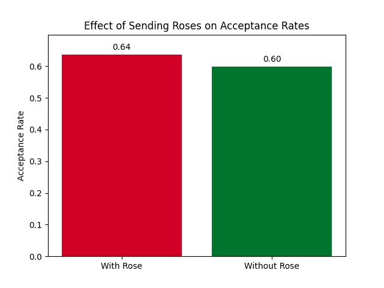

# Preference Signaling

If you have ever applied for a job, ordered an Uber, or asked someone out, you have played part in a [matching market](<https://en.wikipedia.org/wiki/Search_and_matching_theory_(economics)>). Matching markets are numerous and varied, but they all share one thing in common: they bring together various kinds of agents who care about whom they are paired with. Many such markets are becoming increasingly competitive. College admissions rates are at an all-time low [1], and medical students increasingly need to rank more residency programs to ensure a match [2]. Economists have found preference signaling to be a useful tool in boosting one’s chances of matching with their preferred chooser [3, 4, 5].

As a young, single person, who has already gotten into college and is not pre-med, the matching market of relationships is of most interest to me. In 2014, Niederle and Lee conducted an online dating experiment in South Korea where participants were given a limited number of “virtual roses” they could use to “signal special interest when asking for a date.” They found many interesting results, namely that roses increase the likelihood of matching.

### Conceptually understanding `pref-signaling`

1. For now, `pref-signaling` assumes only two types of agents: `Man` and `Woman` types, which are both subclasses of the `Agent` class. The distinction between men and women here is, for now, arbitrary, since both types of agents' behavior is identical. However, the code is designed such that altering one class of agent's behavior, or adding a third or fourth type of agent, is very easy.
2. Each agent is assigned a `desirability` score following a normal distribution. This directly models the desirability score the online dating market assigned to each participant behind the scenes in the Neiderle experiment.
3. Each agent of type `Man` is given the same number of proposals to send, as are all `Woman` agents. The classes `Man` and `Woman` may be allocated a different number of proposals.
4. Roses are the vehicle for preference signaling. They are allocated in the same way across agent class according to a user-defined distribution. Roses may be attached to proposals and are not a separate form of proposal.
5. Currently, each agent will always use up _all_ of their proposals. They might not use all of their roses, though.
6. Agents learn using a [Q-learning](https://en.wikipedia.org/wiki/Q-learning) mechanism
7. Each agent learns two Q-tables: one for learning how to send proposals, and one for learning how to accept proposals. The proposal-sending table is a _n_ x 2 table where _n_ is the number of participants from the opposite sex. Each agent learns the expected reward for sending a normal proposal and rose proposal to each agent of the opposite sex. Similarly, the proposal-accepting table is also _n_ x 2, where agents learn the expected reward of either accepting or rejecting a proposal from each agent of the opposite sex.
8. The simulation process may span dozens of thousands of episodes, over which agents gradually learn their optimal behavior. Each episode, however, is structured the same way. First there is a **proposal phase**, during which agents choose what kinds of proposals to send to who. After every agent has sent their proposals, every agent views the proposals they have received and decides whether or not to accept - this is the **response stage**. Both the action of choosing who to send a proposal to, and the action of choosing to accept a certain proposal or not, gradually shift from random choice to choice based on expected rewards using the respective Q-tables. This shift from exploration to exploitation happens slowly over the course of the simulation.
9. The reward functions for the sending and receiving processes are slightly different, but what is important to know is that agents derive higher rewards from matching with agents with higher desirability scores.
10. Agents **implicitly** learn to associate higher rewards with agents of higher desirability scores. This means that agents **do not** have access to the desirability scores of other agents during the proposal phase. The desirability of other agents is inferred through rewards learned over time.
11. Agents are selective in accordance with their desirability scores.
12. Roses matter less to more desirable agents. As in, the more desirable an agent is, the less a rose has an impact on their decision to accept a proposal.

### Preliminary results

Results so far seem to track with Neiderle and Lee's findings. Roses seem to increase the likelihood that a proposal is accepted, and agents seem to send and accept proposals in accordance with their desirability scores.




## Getting Started

The code in this repo attempts to simulate this experiment using Q-learning agents in Python.

To get started, you'll need to clone and install all the dependencies. If you use the [uv package manager](https://docs.astral.sh/uv/) (which I would recommend), you can simply clone this repo and `uv run sim.py`:

```
$ git clone git@github.com:gbikhazi20/pref-signaling.git
$ uv run sim.py
```

Otherwise, if you use `pip`, you can just `pip install` after cloning:

```
$ pip install -r requirements.txt
```

## Using `pref-signaling` to run experiments

I've tried to make this library simple and intuitive to run experiments in.

The `sim.py` file is the main entry point for running simulations. I've created a command line interface for it so that experiments can easily be run with different settings. Running `python sim.py --help` shows us all the settings we can change when running an experiment:

```
$ python sim.py -h
usage: sim.py [-h] [--num_men NUM_MEN] [--num_women NUM_WOMEN]
              [--num_episodes NUM_EPISODES] [--max_proposals MAX_PROPOSALS]
              [--rose_distribution ROSE_DISTRIBUTION] [--save_results]
              [--save_ep SAVE_EP] [--results_dir RESULTS_DIR]

Run the simulation.

optional arguments:
  -h, --help            show this help message and exit
  --num_men NUM_MEN     Number of male participants. Default is 10.
  --num_women NUM_WOMEN
                        Number of women participants. Default is 10.
  --num_episodes NUM_EPISODES
                        Number of episodes to run. Default is 1000.
  --max_proposals MAX_PROPOSALS
                        Maximum number of proposals each agent can send.
                        Default is 3.
  --rose_distribution ROSE_DISTRIBUTION
                        Distribution of roses. Default is {0.8: 2, 0.2: 6}.
  --save_results        Raise flag to save results
  --save_ep SAVE_EP     Episode on which to start saving results. Only used if
                        --save_results is used. Default is 800.
  --results_dir RESULTS_DIR
                        Directory to save the results to. Default is
                        'results'.
```

All these arguments are optional, so running a simulation can be as simple as:

```
$ python run sim.py
```

Or as fine-grained as:

```
$ uv run sim.py --num_episodes 12000 --num_men 20 --num_women 20 --max_proposals 2 --rose_distribution {.60: 1, .30: 2, .10: 7} --save_results --save_ep 10000 --results_dir sim_results

```

If you choose to save results using the `--save_results` flag, then each agent's Q-tables, as well as their [`Stats`](https://github.com/gbikhazi20/pref-signaling/blob/main/stats/stats.py) object, will be written to the results directory you specified (`results` by default).

You can create visualizations for these results using the `visualize.py` script:

```
$ python visualize.py --results_dir results --save_to visualizations
```

&nbsp;

&nbsp;

&nbsp;

&nbsp;

---

- [1] https://www.sparkadmissions.com/blog/ivy-league-acceptance-rates/
- [2] https://pubmed.ncbi.nlm.nih.gov/39019714/
- [3] https://web.stanford.edu/~niederle/Lee.Niederle.Rose.ExpEcon.2015.pdf
- [4] https://journals.lww.com/academicmedicine/fulltext/2022/05000/The_Otolaryngology_Residency_Program_Preference.20.aspx
- [5] https://onlinelibrary.wiley.com/doi/pdf/10.1111/coep.12216?casa_token=-RMMSaAU2HsAAAAA%3AYdaOUx13kpGZMFLRrNhHY2Yqja3M4sBiOavxrYhhn6J9Ba6xrHIKlnvbiq8PjEEG_17DlbkHdpCa8Q
- [6] https://web.stanford.edu/~niederle/Lee.Niederle.Rose.ExpEcon.2015.pdf
